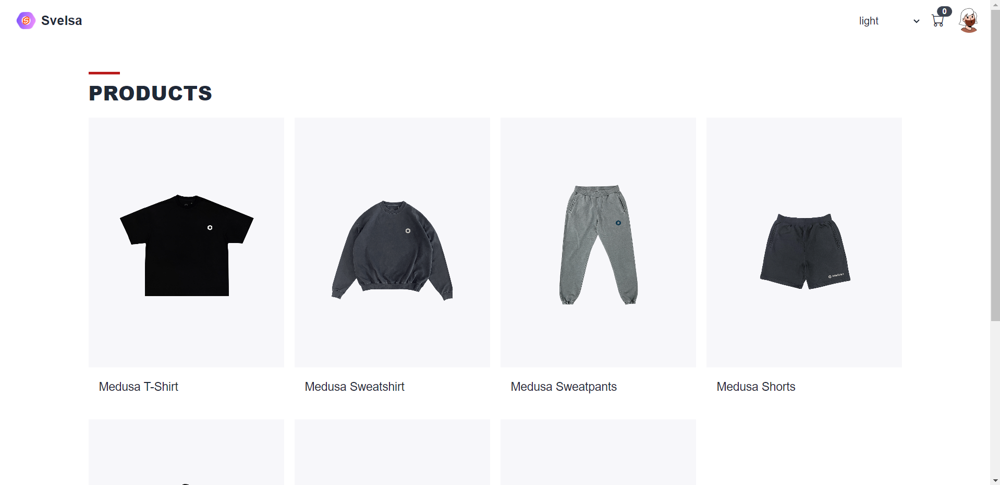
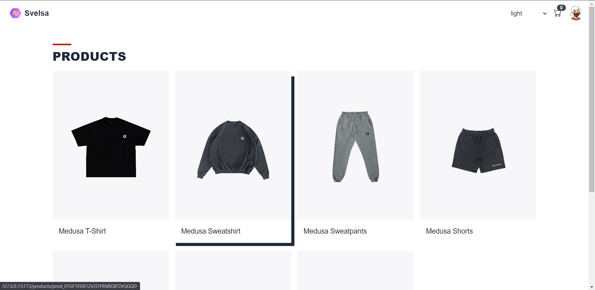
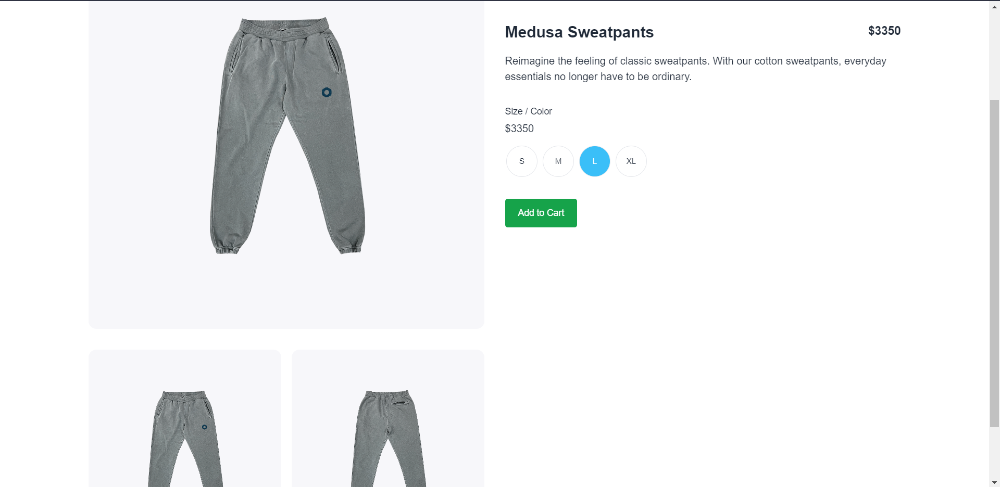
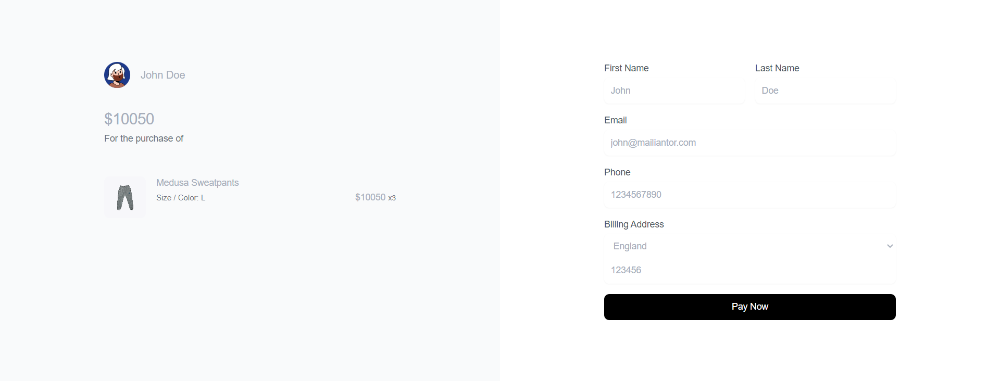
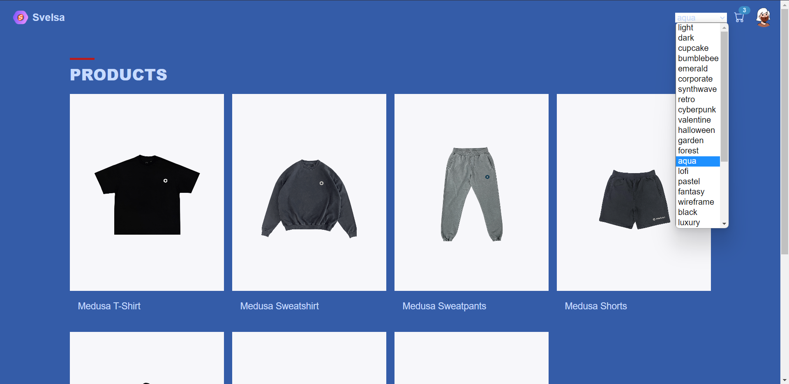

# Svelsa - A starter storefront template in Sveltekit


# About

## Participants

| Name           | Github                                              | Twitter    |
| -------------- | --------------------------------------------------- | ---------- |
| Hetarth Shah   | [@Hetarth02](https://github.com/Hetarth02/)         | @Hetarth02 |
| Sanjay Boricha | [@SanjayBoricha](https://github.com/SanjayBoricha/) | -          |

# Description

An open source storefront built using `MedusaJs` and `Sveltekit` coupled with `DaisyUI(TailwindCSS)` and with lots of swappable themes. Moreover, you can also create your own themes and integrate it by following this [steps](https://daisyui.com/theme-generator/). Currently, It includes products listing, products screen, cart, checkout and payment.

# Preview







# Project Setup

## Prerequisites

Before you start with the tutorial make sure you have

- [Node.js](https://nodejs.org/en/) v14 or greater installed on your machine
- [Medusa server](https://docs.medusajs.com/quickstart/quick-start/) v14 or greater installed on your machine

## Install Project

> Make sure to start the medusa server.

1. Clone the repository:

```bash
git clone https://github.com/Hetarth02/medusa-sveltekit.git
```

2. Change directory and install dependencies:
```bash
cd medusa-sveltekit
npm i
```

3.  Start the app
```
npm run dev
```

## Resources
- [Medusa’s GitHub repository](https://github.com/medusajs/medusa)
- [Medusa Storefront](https://docs.medusajs.com/api/store/)
- [Medusa Documentation](https://docs.medusajs.com/)
- [TailwindCSS Documentation](https://tailwindcss.com/docs/installation)
- [DaisyUI Documentation](https://daisyui.com/components/)
- [DaisyUI Custom Theme Generation Documentation](https://daisyui.com/theme-generator/)